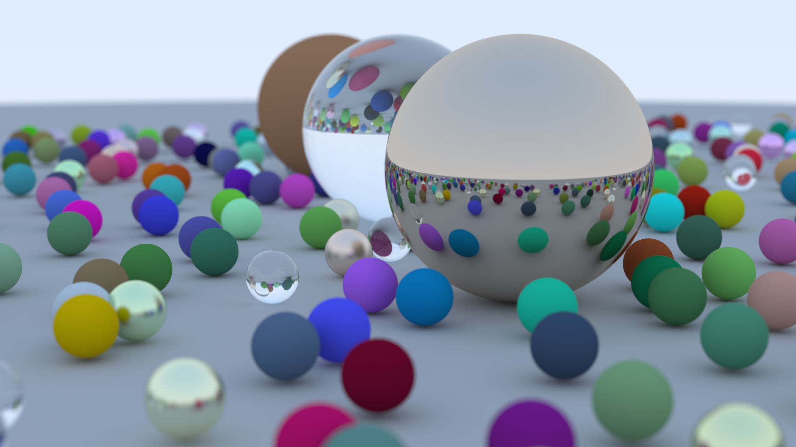

# Ray Tracing Homeworks

This repo is essentially an implementation of the ray tracing methods described in the series of books [Ray Tracing in One Weekend](https://raytracing.github.io/books/RayTracingInOneWeekend.html).

The code is thus very similar to that of the [associated repository](https://github.com/RayTracing/raytracing.github.io).

## Requirements

- C++ >= 17
- CMake >= 3.17

## Content

The content of the project follows the aforementioned books, so:
- classes for basic concepts such as vector, color, ray
- ray-sphere intersection
- surface normals
- antialiasing
- diffuse material
- metal
- dielectric
- motion blur
- bounding volume hierarchy
- textures
- perlin noise
- rectangles
- lights
- volumes
- Monte Carlo integration
- random sampling with a probability density function
